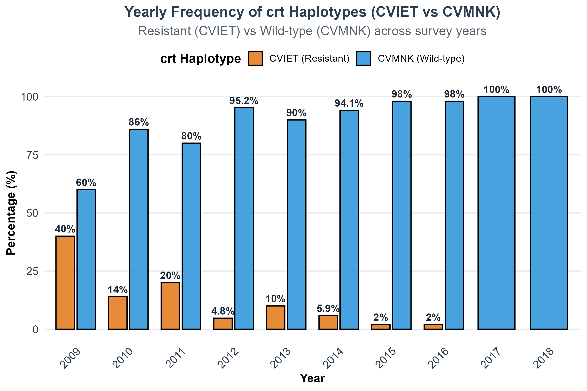
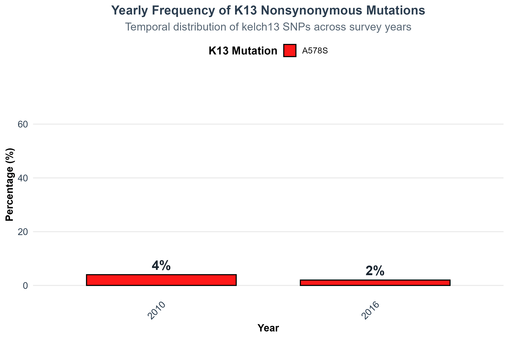
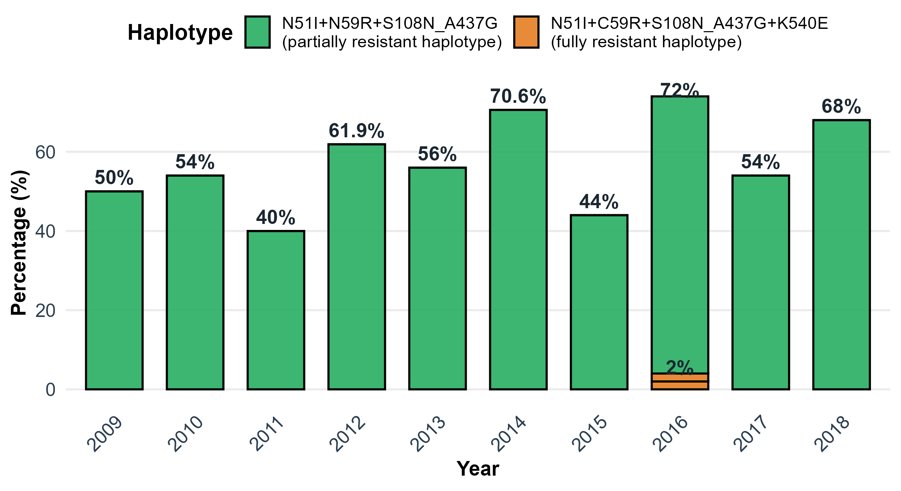

# Hayford_Pf7_project

## Longitudinal Genomic Surveillance of Antimalarial Drug Resistance–Associated Single Nucleotide Polymorphisms in *Plasmodium falciparum*, in the Upper East Region of Ghana

**Authors:** Adjoa Agyemang Boakye, Hayford Osei Offei, David Adedia, Enoch Aninagyei

**Affiliation:** Department of Biomedical Sciences, School of Basic and Biomedical Sciences, University of Health and Allied Sciences, Ho, Ghana

**Corresponding Author:** Enoch Aninagyei — eaninagyei@uhas.edu.gh

---

## 📌 Overview

This repository contains the analysis scripts and key output figures for a retrospective in silico genomic study of *Plasmodium falciparum* drug resistance in the **Upper East Region of Ghana (2009–2018)**, using data from the [MalariaGEN Pf7 dataset](https://www.malariagen.net/data/pf7) and whole-genome sequencing reads from the [European Nucleotide Archive (ENA)](https://www.ebi.ac.uk/ena).

The study characterises:

- **Temporal allele frequency trends** in resistance-associated SNPs across *pfcrt*, *pfmdr1*, *pfdhfr*, *pfdhps*, and *pfk13*
- **Population diversity and structure** using PCA and neighbor-joining phylogenetic reconstruction
- **Whole-genome sequencing (WGS) analysis** of 90 genomes (2010–2018) including QC, alignment, variant calling, and filtering

**Key findings:**
- The *pfcrt* K76T (CVIET) allele declined steadily and was absent by 2018, indicating near-complete reversion to chloroquine sensitivity
- Antifolate-resistant *pfdhfr/pfdhps* haplotypes persisted throughout the study period
- No validated *pfk13* mutations associated with artemisinin resistance were detected
- Phylogenetic analysis revealed a shift from stable early lineages to a genetically diverse, expanding population post-2012

---

## 🗂️ Repository Structure

```
Hayford_Pf7_project/
├── data/
│   └── README.md                              # Instructions for obtaining input data
├── results/
│   ├── k13_mutation_trend_plot_fixed.png      # pfk13 temporal trend plot
│   ├── crt_CVIET_CVMNK_trend_plot_fixed.png  # pfcrt CVIET/CVMNK haplotype trends
│   └── partially_resistant_haplotype_plot2.png # Antifolate haplotype frequency plot
├── scripts/
│   └── plasmodium_variant_pipeline.sh         # Main analysis pipeline (Shell + R)
└── README.md
```

---

## 📥 Input Data

### MalariaGEN Pf7 (SNP trend analysis — 438 samples)

| File | Description |
|------|-------------|
| `Pf7_samples.txt` | Sample metadata including country, region, and year of collection |
| `Pf7_drug_resistance_marker_genotypes.txt` | Pre-curated genotype calls at key drug resistance loci |

> **Download:** https://www.malariagen.net/data/pf7
> See `data/README.md` for full instructions.

### European Nucleotide Archive (WGS analysis — 90 samples)

Raw FASTQ reads for the WGS subset were downloaded from ENA. Sample accession IDs correspond to MalariaGEN Pf7 Ghana / Upper East Region isolates (2010–2018).

> **ENA Portal:** https://www.ebi.ac.uk/ena

Samples were filtered to retain only those from the **Kassena Nankana West District, Upper East Region, Ghana**.

---

## 🔬 Analysis Pipeline

The pipeline (`scripts/plasmodium_variant_pipeline.sh`) covers two parallel workflows:

### 1. SNP Trend Analysis (438 MalariaGEN samples)
- Extraction of allele calls for *pfcrt*, *pfmdr1*, *pfdhfr*, *pfdhps*, and *pfk13* from MalariaGEN SNP tables using custom R scripts
- Annual allele frequency calculation and Pearson's chi-square testing for temporal trends

### 2. Whole-Genome Sequencing Analysis (90 samples)

| Step | Tool | Details |
|------|------|---------|
| Quality control | FastQC | Per-base quality, GC content, adapter contamination |
| Trimming | Trimmomatic | Sliding-window 4:20, min Q20 |
| Alignment | BWA-MEM v0.7.17 | Mapped to *Pf* 3D7 reference genome (GCF_000002765.6); MAPQ ≥ Q20 |
| BAM processing | SAMtools v1.17 | SAM→BAM conversion, sorting, indexing, flagstat QC |
| Variant calling | bcftools v1.17 | mpileup + call; QUAL > 20; biallelic SNPs only |
| PCA | PLINK v1.9 + R | Call rate ≥ 95%, MAF > 0.05, LD pruning (50 5 0.2); `prcomp` in R |
| Phylogenetics | ape + ggtree (R) | Neighbor-joining tree from binary SNP distance matrix |

---

## 🛠️ Dependencies

### R packages
| Package | Purpose |
|---------|---------|
| R v4.1.2 | Core analysis environment |
| ggplot2 | Visualisation |
| dplyr | Data manipulation |
| tidyr | Data reshaping |
| ape | Phylogenetic tree construction |
| ggtree | Phylogenetic tree visualisation |

### Bioinformatics tools
| Tool | Version |
|------|---------|
| FastQC | — |
| Trimmomatic | — |
| BWA-MEM | v0.7.17-r1188 |
| SAMtools | v1.17 |
| bcftools | v1.17 |
| PLINK | v1.9 |

> All analyses were performed in a **WSL2 Ubuntu** environment on an Intel Core i7 system with 16 GB RAM.

---

## 📊 Key Output Figures

### *pfcrt* CVIET / CVMNK Haplotype Trends
Temporal frequency changes in the CVIET (chloroquine-resistant) and CVMNK (wild-type) *pfcrt* haplotypes, showing near-complete reversion to chloroquine sensitivity by 2018.



### *pfk13* Mutation Trends
Temporal trends in *pfk13* mutations across sampled years. No validated artemisinin resistance mutations were detected.



### Antifolate Partial Resistance Haplotypes
Frequency of *pfdhfr/pfdhps* haplotype combinations over time, with the partially resistant haplotype (N51I/C59R/S108N/A437G) remaining predominant throughout.



---

## ▶️ How to Reproduce

```bash
# 1. Clone the repository
git clone https://github.com/Hay77777/Hayford_Pf7_project.git
cd Hayford_Pf7_project

# 2. Download MalariaGEN Pf7 input files and place in data/
#    See data/README.md for full instructions

# 3. Download ENA FASTQ files for the 90 WGS samples
#    (Ghana / Upper East Region isolates from MalariaGEN Pf7)

# 4. Run the full pipeline
bash scripts/plasmodium_variant_pipeline.sh
```

---

## 📄 Citation

If you use this code or results, please cite:

> Agyemang Boakye A, Osei Offei H, Adedia D, Aninagyei E. (*under review*). Longitudinal Genomic Surveillance of Antimalarial Drug Resistance–Associated Single Nucleotide Polymorphisms in *Plasmodium falciparum*, in the Upper East Region of Ghana.

> MalariaGEN *et al.* (2023). An open dataset of *Plasmodium falciparum* genome variation in 7,000 worldwide samples. *Wellcome Open Research*. https://doi.org/10.12688/wellcomeopenres.18681.1

---

## 🔗 Data Sources

| Resource | Link |
|----------|------|
| MalariaGEN Pf7 | https://www.malariagen.net/data/pf7 |
| Pf7 DOI | https://doi.org/10.12688/wellcomeopenres.18681.1 |
| ENA | https://www.ebi.ac.uk/ena |
| *Pf* 3D7 Reference Genome | GCF_000002765.6 |

---

## 📝 License

This project is licensed under the MIT License.
